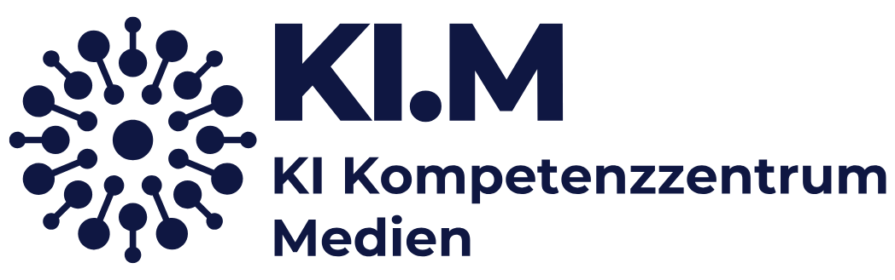

# KI-Kompetenzzentrum Medien (KI.M)

Testing AI applications in a secure, data-sovereign environment for Bavaria's media industry.

[Visit our website](https://medien-bayern.de/ki-kompetenzzentrum-medien/) (in German language only)

## About Us

The KI-Kompetenzzentrum Medien (KI.M) is the central hub for artificial intelligence in Bavaria's media industry. We support media companies in adopting AI solutions that are legally compliant, future-proof, and built on data-sovereign infrastructure.

We provide independent information and hands-on demonstrations of AI capabilities and limitations in media applications. Through our AI Lab, we collaborate with partners to test real-world implementations. Our feasibility studies are published as reports on our website, while the technical foundations and code are shared here in our repositories.

The KI.M is a joint initiative of the Bayrische Landeszentrale für neue Medien (BLM) and Medien.Bayern GmbH, supported by the Bavarian State Chancellery.

**Learn more:** [Visit our website](https://medien-bayern.de/ki-kompetenzzentrum-medien/) (in German language only)

## Using Our Resources

Our repositories contain the technical implementations from our AI Lab projects. In combination with a report each project includes:

- :books: **Code & documentation**: Ready-to-explore implementations with detailed technical documentation
- :point_up: **Legal considerations**: We highlight relevant legal aspects to be aware of when deploying similar solutions
- :newspaper: **Project reports**: Comprehensive feasibility studies explaining use cases, methodologies, and findings

> [!IMPORTANT]
> All code is designed for on-premise deployment, ensuring full data sovereignty and independence from cloud services.

## Completed Projects

Explore our finished projects and their detailed reports to learn from real-world AI implementations in media contexts. Each report includes technical insights, challenges encountered, and practical recommendations.

> [!NOTE]
> **Browse all project reports:** [View Projects](https://medien-bayern.de/news/ki-kompetenzzentrum-medien/werkstattberichte/)

## Have an AI Idea? Apply to Our Lab!

:bulb:**Your idea. Our expertise. One shared prototype.**

Got an innovative AI concept for your media company but lack the resources to create and test it? Our AI Lab can help.

### What We Offer

- :free: **Free access**: No cost to participate
- :computer: **Expert development**: Our team builds prototypes with your guidance
- :gear: **On-Premise testing**: All processing happens locally on our infrastructure
- :page_with_curl: **Complete documentation**: Receive detailed reports with technical insights
- :new: **Knowledge sharing**: Anonymized learnings benefit Bavaria's entire media industry

### How it Works

1. **Submit your idea**: Tell us what you want to achieve
2. **We review**: We check feasibility and current capacity
3. **Collaborative development**: We build a prototype together
4. **You get results**: Detailed report to inform your implementation decisions

Applications are open to all Bavarian media companies, from local radio stations to major publishers.

**Ready to innovate?** [Apply with your AI idea](https://medien-bayern.de/ki-kompetenzzentrum-medien/das-ki-reallabor/)

Always reach out to us via e-mail for questions about our projects and offers.
The KI.M is funded by the Bavarian State Chancellery and operated by BLM as part of Medien.Bayern GmbH