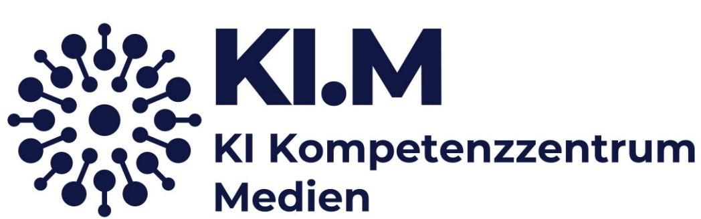

# KI.M - KI Kompetenzzentrum Medien

Testing AI applications in a secure, data-sovereign environment for Bavaria's media industry.

[Visit our website](https://medien-bayern.de/ki-kompetenzzentrum-medien/)

## About Us

The KI.M (AI Competence Center Media) is the central hub for artificial intelligence in Bavaria's media industry. We support media companies in adopting AI solutions that are legally compliant, future-proof, and built on data-sovereign infrastructure.

We provide independent information and hands-on demonstrations of AI capabilities and limitations in media applications. Through our AI Lab, we collaborate with partners to test real-world implementations. Our feasibility studies are published as reports on our website, while the technical foundations and code are shared here in our repositories.

KI.M is a joint initiative of the Bavarian Regulatory Authority for Commercial Broadcasting (BLM) and Medien.Bayern, supported by the Bavarian State Chancellery.

**Learn more:** [Visit our website](https://medien-bayern.de/ki-kompetenzzentrum-medien/)

## Using Our Resources

Our repositories contain the technical implementations from our AI Lab projects. In combination with a report each project includes:

- :books:**Code & Documentation**: Ready-to-explore implementations with detailed technical documentation
- :point_up:**Legal Considerations**: We highlight relevant legal aspects to be aware of when deploying similar solutions
- :newspaper:**Project Reports**: Comprehensive feasibility studies explaining use cases, methodologies, and findings

> [!IMPORTANT]
> All code is designed for on-premise deployment, ensuring full data sovereignty and independence from cloud services.

## Completed Projects

Explore our finished projects and their detailed reports to learn from real-world AI implementations in media contexts. Each report includes technical insights, challenges encountered, and practical recommendations.

> [!NOTE]
> **Browse all project reports:** [View Projects](https://medien-bayern.de/news/ki-kompetenzzentrum-medien/werkstattberichte/)

## Have an AI Idea? Apply to Our Lab!

:bulb:**Your Idea. Our Expertise. A Shared Prototype.**

Got an innovative AI concept for your media company but lack the resources to create and test it? Our AI Lab can help.

### What We Offer

- :free:**Free Access**: No cost to participate
- :computer:**Expert Development**: Our team builds prototypes with your guidance
- :gear:**On-Premise Testing**: All processing happens locally on our infrastructure
- :page_with_curl:**Complete Documentation**: Receive detailed reports with technical insights
- :new:**Knowledge Sharing**: Anonymized learnings benefit Bavaria's entire media industry

### How It Works

1. **Submit Your Idea**: Tell us what you want to achieve
2. **We Review**: We check feasibility and current capacity
3. **Collaborative Development**: We build a prototype together
4. **You Get Results**: Detailed report to inform your implementation decisions

Applications are open to all Bavarian media companies, from local radio stations to major publishers.

:question:**Ready to innovate?** [Apply with your AI idea](https://medien-bayern.de/ki-kompetenzzentrum-medien/das-ki-reallabor/)

---
Always reach out to us via E-Mail for questions about our initiative, offers and projects.
KI.M is funded by the Bavarian State Chancellery and operated by BLM as part of Medien.Bayern GmbH